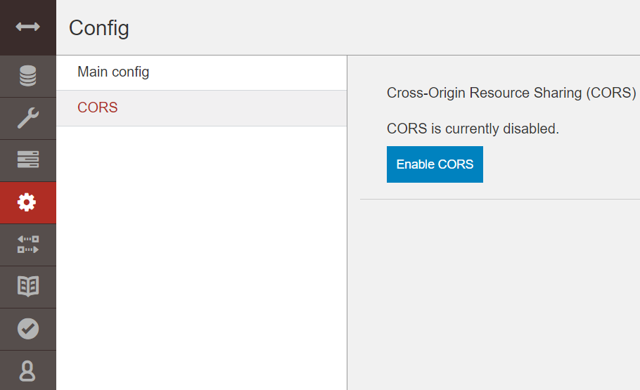
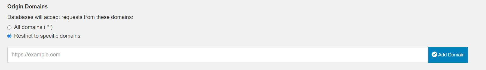

# Constributing

## Development

Im frontend Ordner liegt ein Vue Projekt.

Zum Starten des Frontends kann man diese Befehle ausführen:

```bash
npm install
npm start
```

Die Couchdb Datenbank lässt sich über das docker-compose.yml file starten

Für den Fall, dass die Datenbank vom Frontend nicht erreichbar ist aufgrund eines CORS errors, muss CORS aktiviert werden:

1. In Config auf CORS clicken



2. Enable CORS clicken



3. Die erlaubten Domains eingeben

## Testing
Zum Testen des Projektes wird Cypress verwendet. Zum Starten von Cypress wird folgender Befehl ausgeführt:
```bash
npm run cypress:open
```
